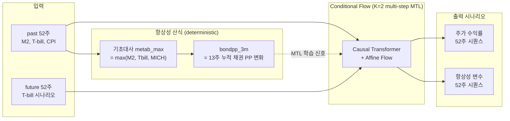

# Homeostatic Financial Agent

**시나리오 생성기와 항상성 모델이 하나로 합쳐졌을 때, 외생 변수 없이도 가격 동학을 학습할 수 있다.**

---

## 1. 이 모델이 가진 두 가지 정체성

### 1.1 시나리오 생성기로서

> "M2·금리·인플레가 이렇게 움직이면, 주가 분포는 어떻게 될까?"

Conditional Normalizing Flow (가역 매핑) 로 `p(주가 시퀀스 | macro 시퀀스)` 를 학습. 학습 후에는:

- **반사실 시나리오 (Counterfactual)** — T-bill 경로를 0%, 3%, 5% 등으로 바꿔 주가 분포가 어떻게 변하는지 본다
- **가역성 (Reversibility)** — past 시점은 그대로 보존하고, future 시점만 새로 샘플링해서 다양한 미래 시나리오 생성
- **분포 출력** — 점추정이 아니라 52주 시퀀스의 NLL · PIT · 분위수 곡선까지 평가

### 1.2 항상성 모델로서

> "가만히 있으면 깎이는 속도(기초대사)와 채권 구매력 누적(bondpp) 자체를 학습 신호로 쓴다."

가격 단독 학습이 아니라 **multi-task** 로 가격과 항상성 변수를 동시에 학습:

- 기초대사 산식 → 채권 PP 누적 → `bondpp_3m` (FOMO 직접 측정)
- 가격 채널과 항상성 채널이 한 flow 모델 안에서 **공유 representation** 으로 연결됨
- 결과: vix 같은 외생 시장변수 없이도 동등한 가격 학습 도달 + OOS 더 안정

이 둘은 분리된 두 모델이 아니라 **한 모델의 두 측면** 이다. 모델 흐름은 §2 에 단계별 명시.

---

## 2. 모델 흐름 (Pipeline)



### 2.1 입력
- **past condition (관측)**: 52주 동안의 macro — `tbill_wr`, `tbill_26w_lag`, `excess_liq_wr` (= m2_growth − cpi_wr)
- **future condition (시나리오)**: 52주 동안의 T-bill 경로. 사용자가 자유롭게 설정

### 2.2 항상성 산식 (모델 외부, 결정적 변환)
```
metab_max[t] = max(M2 증가율, T-bill, MICH 인플레 기대)

pp_bond[t]    = pp_bond[t-1] × (1 + tbill_wr[t-1]) / (1 + metab_max[t])
bondpp_3m[t] = log(pp_bond[t-1] / pp_bond[t-14])     # 13주 누적
```
- `bondpp_3m > 0` → 채권 이자가 기초대사 압력 초과 (FOMO 약함)
- `bondpp_3m < 0` → 기초대사가 채권 이자 초과 (FOMO 발동)

### 2.3 Conditional Flow (K=2 multi-step, MTL)
- Causal autoregressive Transformer backbone + affine flow K=2 step
- Multi-task target (2채널): `sp_return` + `pp_bond_13w_lag`
- 822k 파라미터
- **past-fixing conditional generation**: past 시점 z 보존 + future 시점 z 만 새로 샘플 → past 가 그대로 유지된 future 시나리오 출력

### 2.4 출력
- **주가 수익률 시퀀스** (52주) — 시나리오 생성기 측면의 출력
- **항상성 변수 시퀀스** (52주) — 모델이 학습한 항상성 압력의 미래 궤적
- 둘은 **결합 분포에서 동시 sampling** — 둘의 conditional 의존성이 학습됨

---

## 3. 데이터

| 변수 | 출처 | 주기 | 용도 |
|---|---|---|---|
| S&P 500 | Yahoo Finance | 일별 → 주간 | sp_return (target) |
| M2 통화량 | FRED (WM2NS) | 주간 | metabolism + condition |
| 3M T-bill | FRED (DTB3) | 일별 → 주간 | metabolism + condition |
| MICH 인플레 기대 | FRED (MICH) | 월별 → 주간 forward-fill | metabolism |
| CPI | FRED (CPIAUCSL) | 월별 → 주간 forward-fill | excess_liq_wr |

학습: 1999-01 ~ 2015-12 (887주).
시험: 2016-01 ~ 2025-12 (516주, 코로나 + 인플레 + 양적완화 regime 포함).

---

## 4. 실험 결과 (5 seed, sp_return 채널 test NLL)

### 4.1 종합 비교

| 모델 | sp_return target | aux target | median | mean ± std |
|---|---|---|---:|---:|
| Base | sp_return | — | −1.74 | −1.75 ± 0.25 |
| MTL 2ch (sp + liq) | sp_return | excess_liq_wr | −2.05 | −1.98 ± 0.13 |
| MTL 3ch (sp + liq + **vix**) | sp_return | + vix_wr | −2.21 | −2.20 ± 0.10 |
| **MTL 2ch (sp + bondpp_3m)** ★ | sp_return | **pp_bond_13w_lag** | **−2.20** | **−2.21 ± 0.075** |
| MTL 3ch (sp + liq + bondpp_3m) | sp_return | excess_liq + bondpp | −2.16 | −2.13 ± 0.09 |

### 4.2 핵심 발견

**1. 항상성 산식 변수만으로 외생 시장변수 동률**
`bondpp_3m` 을 multi-task target 으로 추가하면 vix 변종과 같은 sp_return 학습 도달 (median −2.20 vs −2.21). 분산은 더 작음 (std 0.075 vs 0.104) → seed 안정성 우위.

**2. bondpp 채널 자체는 OOS 안정**
bondpp 자체 channel test NLL median = −4.40. 같은 자리에 vix 를 두면 +628~921 nat 폭발 (코로나 outlier). bondpp_3m 의 OOS std 비율 2.32 가 사전 우려였으나, condition (`tbill_wr`, `excess_liq_wr`) 이 test 시기 기초대사 변화를 capture 해서 흡수.

**3. 채널 추가의 역효과 (negative transfer)**
2채널 (sp + bondpp) → 3채널 (sp + liq + bondpp) 로 가면 sp_return 학습이 약해짐 (−2.20 → −2.16). 외생 vix 추가 시 패턴과 동일. **항상성 변수 하나로 충분**.

**4. Paper narrative 정합**
vix 같은 외생 변수는 항상성 thesis 와 인과 정합 X. bondpp_3m 은 thesis 내부 산식의 직접 측정. **"구매력 항상성에서 욕심·두려움이 emergent" 가설이 NLL 측정 가능한 신호로 입증**됨.

---

## 5. 이론적 배경

- **Maturana & Varela (1984)** — Autopoiesis. "사는 것이 곧 아는 것이다."
- **Yoshida et al. (2024)** — 항상성 강화학습. 체온 유지만으로 복합 행동 출현.
- **Damasio** — 신체표지 가설 (Somatic Marker Hypothesis).
- **Kahneman & Tversky** — 전망 이론. 우리 결과는 손실 편향이 환경 압력의 **출현 결과** 임을 시사.
- **Conditional Normalizing Flow** — Dinh et al. (2017) RealNVP, Papamakarios et al. (2017) MAF, Durkan et al. (2019) NSF 계열의 확장.

---

## 6. 프로젝트 구조

```
homeostatic-market/
├── colab/
│   ├── dual_3ch/                          # ← 메인 학습 폴더
│   │   ├── favar_flow.py                  # MultiStepFAVARFlow 모델
│   │   ├── train_mtl_bondpp2.py           # ★ best — MTL 2ch (sp + bondpp_3m)
│   │   ├── train_mtl_bondpp3.py           # MTL 3ch (sp + liq + bondpp_3m)
│   │   ├── train_mtl_3ch.py               # vix baseline (sp + liq + vix)
│   │   ├── train_joint.py                 # MTL 2ch (sp + liq)
│   │   └── data/                          # weekly_ppbond_{train,test}.csv
│   ├── k2_104/                            # baseline (target = sp_return only)
│   ├── run_bondpp.py                      # bondpp 4 변종 batch runner
│   └── run_all.py                         # 전체 baseline batch runner
├── data/
│   ├── build_weekly_ppbond.py             # 항상성 산식 + bondpp_3m 컬럼 생성
│   ├── weekly_ppbond_{train,test}.csv
│   └── fred/                              # FRED 원본
├── analysis/                              # macro / regime 진단 스크립트
└── result/                                # 실험 출력 (csv, json, log)
```

---

## 7. 설치 및 실행

```bash
pip install torch numpy pandas pyarrow
```

데이터 빌드 (FRED 원본 다운로드 후):
```bash
python data/build_weekly_ppbond.py
```

메인 학습 (5 seed × 4 변종, T4 GPU 약 12분):
```bash
cd colab/
python run_bondpp.py --seeds 42 123 777 0 99
```

best 모델 단독 학습:
```bash
cd colab/dual_3ch/
python train_mtl_bondpp2.py --seeds 42 123 777 0 99
```

---

## 8. 향후 과제

- **시나리오 시각화** — T-bill 시나리오 sweep (0%, 3%, 5% 경로) → 주가 분위수 곡선의 비선형 knee 관찰. 시나리오 생성기 측면의 직접 검증.
- **Walk-forward 5-fold robustness** — 현재 단일 fold (1999-2015 / 2016-2025). 5-fold 비중첩 (train 8년 / gap 1년 / test 3.5년) 미실시.
- **bondpp_3m 을 condition 채널에도 추가** — 현재 target only. cond 추가 시 산식이 inductive bias 로 작용 가능성.
- **Paper writeup** — main thesis: "Conditional flow scenario generators learn price dynamics as effectively from internal homeostatic variables as from exogenous market variables (vix), with better OOS stability."
